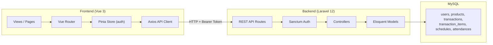

# Laporan Perinci: POTI System

## 1. Ringkasan Eksekutif

**POTI System** (Pojok TI HMJ TI) adalah aplikasi web kasir dan manajemen operasional untuk unit usaha HMJ TI yang menjual makanan dan minuman. Proyek ini menggantikan pencatatan manual dengan sistem digital yang mencakup transaksi penjualan, manajemen stok, jadwal piket, dan absensi petugas.

Proyek ini berbentuk **monorepo** dengan pemisahan jelas antara backend API dan frontend SPA. Dokumentasi produk sudah lengkap di folder `docs/`, dan implementasi kode sudah mencakup hampir seluruh fitur MVP — meskipun sebagian besar perubahan **belum di-commit** ke Git (hanya ada 1 commit: `Initial project structure`).

---

## 2. Struktur Proyek

```
poti-system/
├── backend/          # Laravel 12 API
├── frontend/         # Vue 3 SPA
└── docs/             # Dokumentasi produk & teknis
    ├── PRD.md
    ├── PROJECT_CONTEXT.md
    ├── DATABASE_SCHEMA.md
    ├── TASKS.md
    └── UI_GUIDELINES.md
```

| Komponen | Teknologi | Versi |
|----------|-----------|-------|
| Backend | Laravel + Sanctum | PHP 8.2+, Laravel 12 |
| Frontend | Vue 3 + Vite + Pinia + Vue Router | Vue 3.5, Vite 8 |
| Styling | Tailwind CSS | v4 |
| HTTP Client | Axios | 1.18 |
| Database | MySQL | — |
| Auth | Laravel Sanctum (Bearer Token) | v4.3 |

---

## 3. Tujuan & Masalah yang Diselesaikan

### Masalah saat ini (manual)
- Harga produk dicari dari daftar kertas
- Perhitungan total dan kembalian manual
- Stok dihitung manual
- Tidak ada laporan penjualan otomatis
- Jadwal piket tidak terintegrasi
- Sulit melacak siapa yang melakukan transaksi

### Tujuan sistem
- Mempermudah transaksi penjualan
- Mengotomatisasi pengurangan stok
- Menyediakan laporan transaksi
- Mengelola jadwal dan absensi piket
- Dashboard ringkas untuk admin

---

## 4. Peran Pengguna (Role-Based Access)

### Admin
| Fitur | Akses |
|-------|-------|
| Dashboard | ✅ |
| CRUD Produk | ✅ |
| Lihat semua transaksi | ✅ |
| Kelola jadwal piket | ✅ (tambah & hapus) |
| Lihat absensi semua petugas | ✅ |
| Kasir | ❌ (tidak ada di navigasi) |

### Piket
| Fitur | Akses |
|-------|-------|
| Dashboard (data sendiri) | ✅ |
| Kasir / transaksi | ✅ |
| Jadwal (milik sendiri) | ✅ |
| Absensi (check in/out) | ✅ |
| Riwayat transaksi (milik sendiri) | ✅ |

Autentikasi menggunakan **Laravel Sanctum** dengan token Bearer. Middleware `EnsureUserRole` membatasi endpoint berdasarkan role (`admin` / `piket`).

---

## 5. Arsitektur Sistem



**Pola arsitektur:**
- Frontend: SPA dengan routing client-side, state auth di Pinia + localStorage
- Backend: RESTful API, tanpa server-side rendering untuk fitur utama
- Komunikasi: JSON over HTTP, CORS dikonfigurasi untuk `localhost:5173`

---

## 6. Skema Database

6 tabel utama dengan relasi Eloquent:

```
users
├── transactions (1:N)
├── schedules (1:N)
└── attendances (1:N)

products
└── transaction_items (1:N)

transactions
└── transaction_items (1:N)
```

| Tabel | Field Penting |
|-------|---------------|
| `users` | name, email, password, role (admin/piket) |
| `products` | name, price, stock, status (active/out_of_stock) |
| `transactions` | user_id, total_amount, paid_amount, change_amount |
| `transaction_items` | transaction_id, product_id, quantity, price, subtotal |
| `schedules` | user_id, date, shift |
| `attendances` | user_id, check_in, check_out |

Ada migration khusus (`000010_align_existing_schema_with_poti_docs`) yang menyesuaikan skema lama ke spesifikasi dokumentasi — menandakan proyek pernah melalui iterasi desain.

---

## 7. API Endpoints

| Method | Endpoint | Role | Fungsi |
|--------|----------|------|--------|
| POST | `/api/login` | Public | Login |
| GET | `/api/me` | Auth | Data user saat ini |
| POST | `/api/logout` | Auth | Logout |
| GET | `/api/dashboard` | Auth | Statistik dashboard |
| GET | `/api/products` | Auth | Daftar produk (paginated) |
| POST/PUT/DELETE | `/api/products` | Admin | CRUD produk |
| GET | `/api/transactions` | Auth | Riwayat transaksi |
| POST | `/api/transactions` | Piket/Admin | Checkout transaksi |
| GET | `/api/schedules` | Auth | Daftar jadwal |
| POST/PUT/DELETE | `/api/schedules` | Admin | Kelola jadwal |
| GET | `/api/attendances` | Auth | Riwayat absensi |
| POST | `/api/attendances/check-in` | Piket/Admin | Check in |
| POST | `/api/attendances/check-out` | Piket/Admin | Check out |
| GET | `/api/users` | Admin | Daftar user (untuk assign jadwal) |

---

## 8. Fitur Frontend (Halaman)

| Halaman | File | Status |
|---------|------|--------|
| Login | `LoginView.vue` | ✅ Selesai |
| Dashboard | `DashboardView.vue` | ✅ Selesai |
| Produk (Admin) | `ProductsView.vue` | ✅ CRUD + search |
| Kasir (Piket) | `CashierView.vue` | ✅ Keranjang + checkout |
| Transaksi | `TransactionsView.vue` | ✅ Daftar (tanpa detail) |
| Jadwal | `SchedulesView.vue` | ✅ Tambah/hapus (tanpa edit) |
| Absensi | `AttendanceView.vue` | ✅ Check in/out + riwayat |

**Komponen reusable:** `PageHeader.vue`, `EmptyState.vue`, `AppLayout.vue` (sidebar + navigasi role-based).

**Desain UI** mengikuti `UI_GUIDELINES.md`:
- Tema light, background `#F8FAFC`, accent biru `#2563EB`
- Font Inter, border radius 12px, spacing 8px system
- Desktop-first, responsive untuk tablet/laptop

---

## 9. Logika Bisnis Penting

### Transaksi (Checkout)
Logika transaksi di `TransactionController` cukup robust:
- Menggunakan **database transaction** (`DB::transaction`)
- **Row locking** (`lockForUpdate()`) untuk mencegah race condition stok
- Validasi stok sebelum checkout
- Validasi nominal bayar ≥ total
- Pengurangan stok otomatis per item
- Update status produk ke `out_of_stock` jika stok habis

### Dashboard
- Admin: statistik global hari ini
- Piket: statistik transaksi milik sendiri + jadwal hari ini

### Absensi
- Tidak bisa check in jika masih ada sesi aktif (belum check out)
- Tidak bisa check out jika belum check in

---

## 10. Data Seed (Development)

`DatabaseSeeder` menyediakan data uji:

| Akun | Email | Password | Role |
|------|-------|----------|------|
| POTI Admin | `admin@poti.local` | `password` | admin |
| Rahma Piket | `piket@poti.local` | `password` | piket |
| Nanda Piket | `nanda@poti.local` | `password` | piket |

Plus 4 produk contoh (Nasi Goreng, Mie Ayam, Es Teh, Roti Bakar) dan 2 jadwal piket.

---

## 11. Status Implementasi vs MVP

Berdasarkan perbandingan kode aktual dengan `PRD.md` dan `TASKS.md`:

| Fitur MVP | Backend | Frontend | Catatan |
|-----------|---------|----------|---------|
| Login | ✅ | ✅ | Email atau username |
| Role Management | ✅ | ✅ | Middleware + router guard |
| CRUD Produk | ✅ | ✅ | Search client-side |
| Transaksi Kasir | ✅ | ✅ | Keranjang + checkout |
| Pengurangan Stok | ✅ | — | Otomatis di backend |
| Jadwal Piket | ✅ | ⚠️ | Edit jadwal belum ada di UI |
| Absensi | ✅ | ✅ | Check in/out |
| Riwayat Transaksi | ✅ | ⚠️ | Daftar ada, detail belum |
| Dashboard | ✅ | ✅ | 4 stat card + jadwal hari ini |
| Testing | ❌ | ❌ | Hanya `ExampleTest` bawaan |

**Catatan:** File `TASKS.md` masih menandai semua task sebagai `[ ] Not Started`, padahal implementasinya sudah jauh lebih maju — dokumentasi task belum diperbarui.

---

## 12. Keterbatasan & Gap yang Ditemukan

1. **Belum ada README root** — tidak ada panduan setup/run di level proyek
2. **Perubahan belum di-commit** — hampir seluruh implementasi MVP masih uncommitted/untracked
3. **Tidak ada unit/feature test** untuk logika bisnis (auth, transaksi, stok)
4. **Detail transaksi** — API `GET /transactions/{id}` ada, tapi tidak ada UI-nya
5. **Edit jadwal** — API `PUT /schedules/{id}` ada, frontend belum implementasi
6. **Tidak ada konfirmasi hapus** — delete produk/jadwal langsung tanpa dialog
7. **Pagination UI** — backend support pagination, frontend load `per_page: 50/100` sekaligus
8. **Notifikasi** — UI guidelines menyebut toast, implementasi masih inline message sederhana
9. **Manajemen user** — hanya list user piket, tidak ada CRUD user
10. **Admin tidak bisa akses kasir** — navigasi admin tidak menyertakan halaman Cashier
11. **Login form** — pre-filled dengan kredensial default (cocok dev, kurang aman production)
12. **Mobile** — UI guidelines: mobile optional untuk MVP, layout belum dioptimalkan penuh

---

## 13. Fitur Masa Depan (Sudah Didokumentasikan)

Dari `PROJECT_CONTEXT.md` dan `TASKS.md`:
- QRIS Payment
- Export PDF / Excel
- Analytics Dashboard
- PWA Support
- Barcode Scanner
- Dark Mode

---

## 14. Cara Menjalankan (Berdasarkan Konfigurasi)

### Backend
```bash
cd backend
composer install
cp .env.example .env   # sesuaikan DB MySQL: poti_system
php artisan key:generate
php artisan migrate --seed
php artisan serve        # http://127.0.0.1:8000
```

Atau gunakan script dev Laravel:
```bash
composer run dev   # serve + queue + logs + vite backend
```

### Frontend
```bash
cd frontend
npm install
npm run dev   # http://localhost:5173
```

Variabel `VITE_API_BASE_URL` (opsional) default ke `http://127.0.0.1:8000/api`.

---

## 15. Kesimpulan

**POTI System** adalah proyek yang **terencana dengan baik** — dokumentasi produk (PRD, schema DB, UI guidelines, task breakdown) lengkap dan konsisten dengan implementasi kode. Arsitektur modern (Laravel API + Vue SPA) cocok untuk kebutuhan kasir kampus.

**Tingkat kematangan:** MVP fungsional ~**85–90%**. Core flow (login → kasir → checkout → stok berkurang → riwayat transaksi) sudah berjalan end-to-end. Yang masih kurang terutama polish UI (detail transaksi, edit jadwal, toast, konfirmasi hapus), testing, dan dokumentasi operasional (README setup).

**Rekomendasi prioritas berikutnya:**
1. Commit & push perubahan yang ada
2. Tambah README root dengan instruksi setup
3. Update `TASKS.md` agar reflect status aktual
4. Tulis feature test untuk flow transaksi & auth
5. Lengkapi UI detail transaksi dan edit jadwal
6. Hapus kredensial default dari form login sebelum production

Kalau kamu mau, saya bisa lanjut dengan hal spesifik — misalnya menulis README setup, menambah test, atau melengkapi fitur yang masih gap.